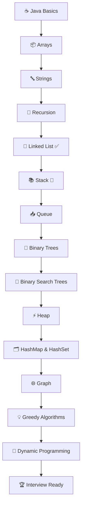

# 🚀 JAVA DSA Journey

> *Learning Data Structures & Algorithms in Java — one problem, one concept, and one commit at a time.*

---

## 👋 About this Repository

Hi! 👋 I'm currently learning **Data Structures & Algorithms (DSA) in Java**, and this repository is where I document my learning journey.

Rather than uploading only the final solutions, I use this repository to track everything I learn—from understanding the basics to solving interview-level problems. Every folder, every commit, and every solution reflects my progress as I continue improving my problem-solving skills.

My goal is to build a strong foundation in DSA, prepare for software engineering interviews, and become a better developer one step at a time.

---

## 🎯 What You'll Find Here

This repository contains my implementations, notes, and practice problems on various DSA topics.

Along the way, I focus on:

- Writing clean and readable Java code
- Understanding concepts instead of memorizing solutions
- Learning multiple approaches whenever possible
- Improving time and space complexity
- Building consistency through daily practice

---

## 📂 Repository Structure

```text
JAVA_DSA
│
├── Arrays
├── Strings
├── Recursion
├── Linked List
├── Stack
├── Queue
├── Trees
├── Graph
└── ...
```

---

## 📚 Progress

### ✅ Completed

- Java Basics
- Arrays
- Strings
- Recursion
- Linked List

### 🔄 Currently Learning

- Stack

### ⏳ Coming Next

- Queue
- Binary Trees
- Binary Search Trees
- Heap
- HashMap & HashSet
- Trie
- Graph
- Greedy Algorithms
- Dynamic Programming

---

## 🗺️ Learning Roadmap



---

## 📊 Learning Progress

```text
Java Basics          ██████████ 100%
Arrays               ██████████ 100%
Strings              ██████████ 100%
Recursion            ██████████ 100%
Linked List          ██████████ 100%
Stack                ███████░░░  70%
Queue                ░░░░░░░░░░   0%
Trees                ░░░░░░░░░░   0%
Heap                 ░░░░░░░░░░   0%
Hashing              ░░░░░░░░░░   0%
Graph                ░░░░░░░░░░   0%
Dynamic Programming  ░░░░░░░░░░   0%
```

---

## 💻 Why I Created This Repository

I wanted one place where I could:

- Keep all my DSA practice organized
- Track my learning consistently
- Revisit concepts whenever needed
- Share my progress publicly

This repository isn't meant to showcase perfect code—it's meant to showcase continuous learning.

---

## 🧠 Practice Platforms

Most of the problems in this repository are inspired by or practiced from:

- LeetCode
- GeeksforGeeks
- Striver's A2Z DSA Sheet
- CodeForces

For every new topic, I try to:

- Understand the concept first
- Solve the brute-force approach
- Optimize the solution
- Write clean and readable code
- Learn the pattern behind the problem

---

## 🎯 Current Goal

I'm currently preparing for:

- 💼 Software Engineering Internships
- 💻 Product-Based Company Interviews
- 🎓 Campus Placements
- 🧩 Online Coding Assessments

My aim isn't just to solve more problems—it's to become better at thinking through problems and writing efficient code.

---

## 🌱 A Work in Progress

Learning DSA is a marathon, not a sprint.

I'll continue updating this repository as I learn new concepts, solve more problems, and revisit older solutions with better approaches whenever possible.

Every commit represents a small step forward.

---

## 🤝 Contributions & Suggestions

If you find a cleaner approach, a better solution, or an optimization, feel free to open an **Issue** or submit a **Pull Request**.

I'm always happy to learn from the community.

---

## ⭐ Support

If you found this repository helpful or enjoyed following my learning journey, consider giving it a **Star ⭐**.

It motivates me to keep learning, building, and sharing my progress.

---

### Happy Coding! 🚀
